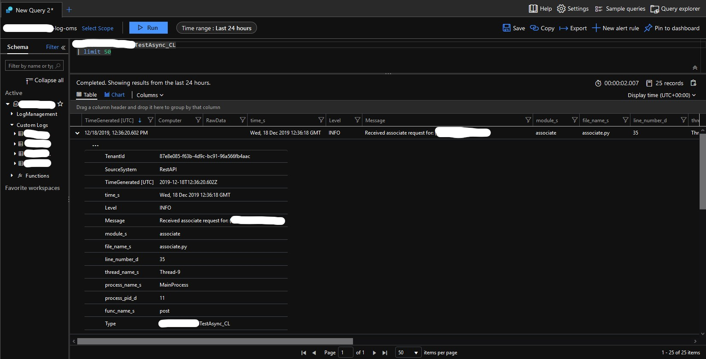

# Python Logging Azure Workspace OMS Extension

[](https://pypi.python.org/pypi/logging-azure)
[](https://pypi.python.org/pypi/logging-azure)
[](https://github.com/psf/black)

This package provides an asynchronous solution for uploading application logs to an Azure Log Workspace using their
provided REST API, all supplied as a handler and service extension for python builtin `logging` module.

The service works by instantiating an always-alive (non-daemonized) thread connected to a log request pool in which
logs will be queued, then periodically running through the pool in order to send the requests asynchronously in bulk
using the `grequests` package. This is all to intend logging safely without interrupting or slowing down the main
process execution as transparently as possible.

## Installation

For installing via the distributed package via PyPi:

`$ pip install logging-azure`

Or if you which to install from the source, you can checkout the git repository and install using `setuptools`:

`$ python setup.py install`

### Special conditions

#### Installing GEvent

If you require using this package within a docker distributed application image for example, you will
be required to have an available compiler and necessary libraries in order to build `cython` and `gevent` needed for
`grequests` to run.

If using an Alpine image for example, this can be accomplished with the following:

```dockerfile
FROM python:3.7.4-alpine3.9

# Install required dependencies for building like git etc.
RUN apk add --virtual .build-dep build-base [...]

# Install the python package
RUN pip install --no-cache-dir logging-azure

# Cleanup no-longer required dependencies for a lighter image
RUN apk del .build-dep
```

#### GEvent monkey patching ssl

As this package leverages the `grequests` package, which itself uses `gevent`, in several cases,
like running in a debug Flask server, you may need to monkey patch `gevent` for things to work correctly.

For this you just need to run the following **as early as possible** within your application:

```python
from gevent import monkey

monkey.patch_all()
```

Usually, you are warned by `gevent` itself when running your application if this is needed or not done early enough,
so it shouldn't be hard to miss.

## Usage

### Package Configuration

The following environment variables are read to configure the extension and are required:

- `AZURE_LOG_CUSTOMER_ID`: Customer ID for the Azure Log Workspace
- `AZURE_LOG_SHARED_KEY`: Customer shared key for the Azure Log Workspace
- `AZURE_LOG_DEFAULT_NAME`: The default "log type" name to indicate where the logs are stored.
This will be suffixed with "_CL" within the Azure Log Workspace.

The following environment variables are read to tweak some parameters of the extension,
they all have default values and therefore are optional:

- `AZURE_LOG_MAX_CONCURRENT_REQUESTS`: *Default: 10* The maximum number of asyncronous requests to handle at once.
Used by `grequests`
- `AZURE_LOG_SEND_FREQUENCY`: *Default: 5* How many seconds the service thread should wait before sending pooled logs.

### Logging Configuration

As you would any other handler, you only require to define a handler using the
`logging_azure.handler.AzureLogServiceHandler` class:

```python
[...]
    "handlers": {
        "console": {"level": logging.DEBUG, "class": "logging.StreamHandler", "formatter": "colorize"},
        "azure_log_oms": {
            "level": logging.INFO, "class": "logging_azure.handler.AzureLogServiceHandler", "formatter": "azure"
        },
        "default": {"level": logging.INFO, "class": "logging.StreamHandler", "formatter": "default"},
    },
[...]
```

Then add the handler to your selected logger instance:

```python
[...]
    "loggers": {
        LOGGER_NAME: {
            "handlers": ["console"] if IS_LOCAL_DEV_INSTANCE else ["default", "azure_log_oms"],
            "level": LOG_LEVEL,
            "propagate": True,
        }
    },
[...]
```

## Recommendations

### Set an appropriate log level minimum

In order to prevent additional cost from Azure Log OMS ingestion for talkative applications, it is recommended to set
an adequate LOG_LEVEL for your application (avoid `logging.DEBUG` for example).

It is also recommended to configure your loggers appropriately so the `AzureLogServiveHandler` isn't used during
local development or CI environments for example.

You are warned.

### Set a clear formatter for messages

This package supplies a decent amount of information already to complement the message in a clean way by reading the
log record in order to facilitate Azure Log OMS Queries and ingestion, so you may only require using a specific
formatter that will only format the `message` itself as follows:

```python
[...]
    "formatters": {
        "default": {
            "format": '[%(asctime)s] %(levelname)s %(name)s %(module)s "%(message)s"',
            "datefmt": "%d/%b/%Y %H:%M:%S",
        },
        "azure": {
            "format": '%(message)s',
        },
[...]
```

This provides the following output within the Azure Portal for example:



This allows for easily creating custom queries and alerts for your application directly from the Azure Log OMS
solution.

## Useful links

- [Create a Log Analytics workspace in the Azure portal](https://docs.microsoft.com/en-us/azure/azure-monitor/learn/quick-create-workspace)
- [Create a Log Analytics workspace with Azure CLI 2.0](https://docs.microsoft.com/en-us/azure/azure-monitor/learn/quick-create-workspace-cli)
- [Manage access to log data and workspaces in Azure Monitor](https://docs.microsoft.com/en-us/azure/azure-monitor/platform/manage-access)
- [Azure Monitor pricing](https://azure.microsoft.com/en-us/pricing/details/monitor/)

### Package requirements

- [grequests](https://github.com/spyoungtech/grequests)
- [gevent](https://github.com/gevent/gevent)
- [cython](https://github.com/cython/cython)
- [injector](https://github.com/alecthomas/injector)

